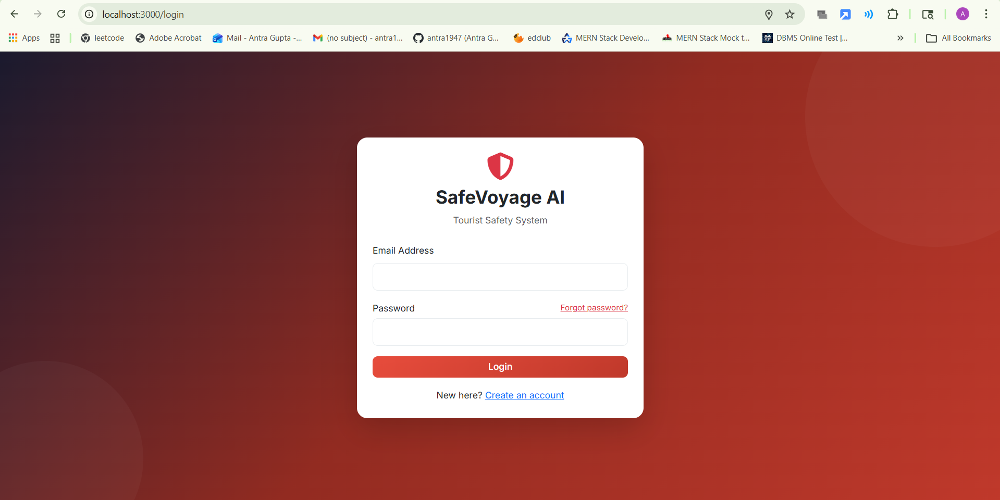
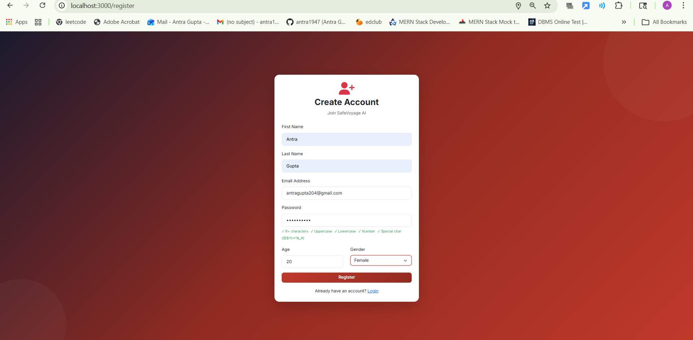
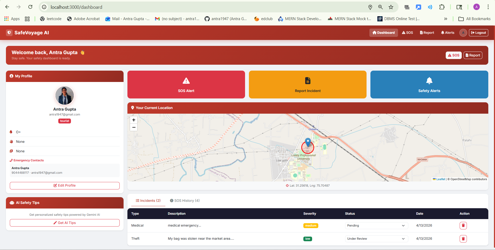
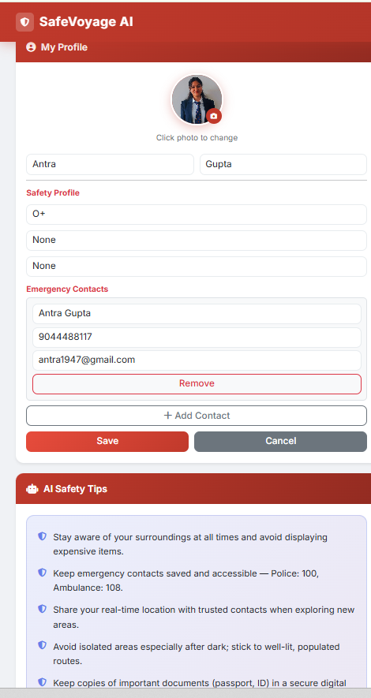
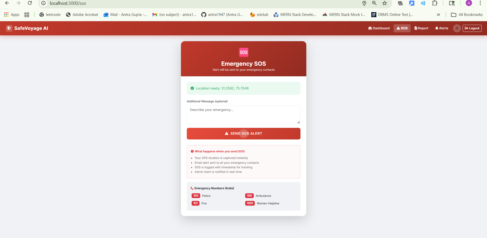
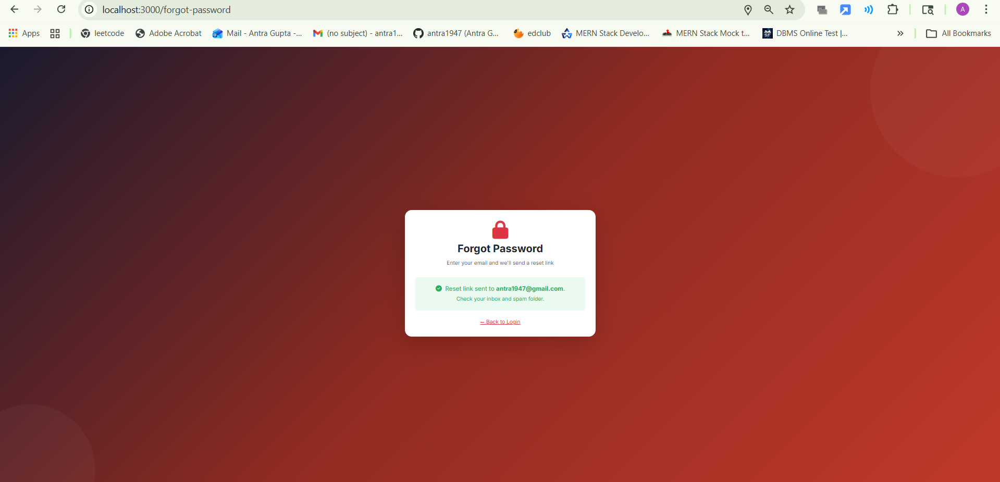
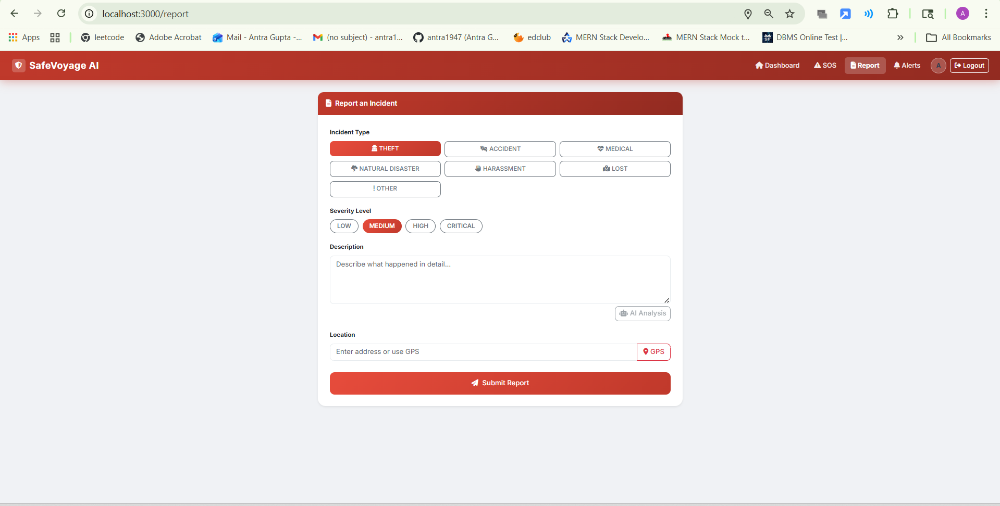
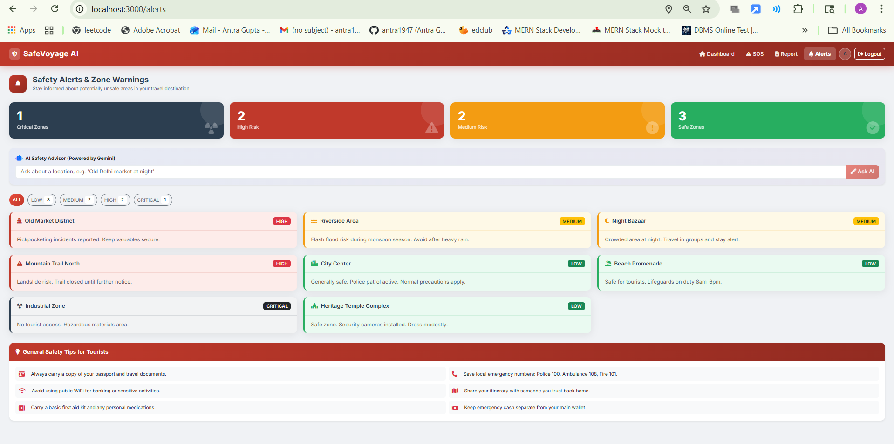

# SafeVoyage AI — Enterprise Tourist Safety & Incident Intelligence Platform

A production-ready, full-stack MERN application built for real-world tourist safety. Features real-time location tracking, AI-powered safety advice, emergency SOS with email alerts, incident reporting, and an admin control panel.

---

## Screenshots

### Login Page


### Register Page (with password strength indicator)


### Dashboard


### Profile Edit (Safety Profile + Emergency Contacts)


### Emergency SOS


### Forgot Password


### Report an Incident


### Safety Alerts & Zone Warnings



---

## Tech Stack

**Frontend**
- React.js (Context API)
- Bootstrap 5
- Leaflet.js (live map)
- Axios
- react-hot-toast (notifications)

**Backend**
- Node.js + Express.js (MVC + Microservices)
- MongoDB + Mongoose (geospatial 2dsphere)
- Socket.IO (real-time location)
- JWT Authentication + bcrypt
- Joi Validation (with password strength rules)
- Nodemailer (Gmail / Amazon SES)
- Helmet + Rate Limiting + Morgan
- express-mongo-sanitize (NoSQL injection prevention)
- EJS (map interface)
- Google Gemini AI (`gemini-1.5-flash`)

---

## Project Structure

```
├── backend/
│   ├── src/
│   │   ├── config/
│   │   │   ├── db.js
│   │   │   └── validateEnv.js
│   │   ├── middleware/
│   │   │   ├── auth.js
│   │   │   └── validate.js
│   │   ├── modules/
│   │   │   ├── auth/
│   │   │   ├── user/
│   │   │   ├── emergency/
│   │   │   ├── incident/
│   │   │   ├── location/
│   │   │   ├── admin/
│   │   │   └── ai/
│   │   ├── utils/
│   │   │   ├── emailService.js
│   │   │   └── logger.js
│   │   ├── views/map.ejs
│   │   └── app.js
│   ├── services/                  ← Microservices
│   │   ├── api-gateway/           → port 7000
│   │   ├── auth-service/          → port 7001
│   │   ├── user-service/          → port 7002
│   │   ├── incident-service/      → port 7003
│   │   ├── emergency-service/     → port 7004
│   │   └── location-service/      → port 7005
│   ├── .env.example
│   └── package.json
└── frontend/
    ├── src/
    │   ├── components/
    │   ├── context/AuthContext.js
    │   ├── pages/
    │   │   ├── Login.js
    │   │   ├── Register.js
    │   │   ├── Dashboard.js
    │   │   ├── SOSPage.js
    │   │   ├── IncidentReport.js
    │   │   ├── SafetyAlerts.js
    │   │   ├── AdminPanel.js
    │   │   ├── ForgotPassword.js
    │   │   ├── ResetPassword.js
    │   │   └── NotFound.js
    │   ├── styles/global.css
    │   ├── api.js
    │   └── App.js
    └── package.json
```

---

## Environment Variables

Copy `backend/.env.example` to `backend/.env` and fill in:

```env
PORT=7000
DB_CONNECTION_STRING=your_mongodb_uri
JWT_SECRET=your_32_char_random_secret

# Gmail
EMAIL_PROVIDER=gmail
EMAIL_USER=your_email@gmail.com
EMAIL_PASS=your_gmail_app_password

# Amazon SES (alternative)
# EMAIL_PROVIDER=ses
# SES_HOST=email-smtp.ap-south-1.amazonaws.com
# SES_PORT=587
# SES_USER=your_ses_user
# SES_PASS=your_ses_pass

ALLOWED_ORIGINS=http://localhost:3000
FRONTEND_URL=http://localhost:3000

# Gemini AI
GEMINI_API_KEY=your_gemini_api_key

# Logging
LOG_LEVEL=info
```

> Get Gmail App Password: Google Account → Security → 2-Step Verification → App Passwords
> Get Gemini API Key free at: https://aistudio.google.com

---

## Local Setup

### 1. Backend
```bash
cd backend
npm install
npm run dev
```
Runs on `http://localhost:7000`

### 2. Frontend
```bash
cd frontend
npm install
npm start
```
Runs on `http://localhost:3000`

### 3. Microservices (Alternative)
```bash
cd backend/services
node start-all.js
```
Starts all 6 services (ports 7000–7005)

### 4. Make Admin Account
Register normally, then run in MongoDB shell:
```js
db.users.updateOne({ email: "your@email.com" }, { $set: { role: "admin" } })
```

---

## API Endpoints

### Auth
| Method | Endpoint | Description |
|--------|----------|-------------|
| POST | `/api/auth/register` | Register (password: 8+ chars, uppercase, lowercase, number, special char) |
| POST | `/api/auth/login` | Login |
| POST | `/api/auth/forgot-password` | Send password reset email |
| POST | `/api/auth/reset-password/:token` | Reset password (15 min token) |

### User
| Method | Endpoint | Description |
|--------|----------|-------------|
| GET | `/api/user/profile` | Get profile |
| PATCH | `/api/user/profile` | Update profile + safety profile + emergency contacts + photo |

### Emergency
| Method | Endpoint | Description |
|--------|----------|-------------|
| POST | `/api/emergency/sos` | Trigger SOS — sends HTML email to all emergency contacts + confirmation to sender |
| GET | `/api/emergency/history` | Get SOS history |
| GET | `/api/emergency/:id` | Get single emergency |
| PATCH | `/api/emergency/:id/resolve` | Resolve emergency |
| DELETE | `/api/emergency/:id` | Delete SOS record |

### Incidents
| Method | Endpoint | Description |
|--------|----------|-------------|
| POST | `/api/incidents` | Report incident |
| GET | `/api/incidents/my` | My incidents (paginated) |
| GET | `/api/incidents` | All incidents — admin (search, filter, paginated) |
| PATCH | `/api/incidents/:id/mystatus` | User updates own incident status |
| PATCH | `/api/incidents/:id/status` | Admin updates incident status |
| DELETE | `/api/incidents/:id` | User deletes own incident |

### Admin
| Method | Endpoint | Description |
|--------|----------|-------------|
| GET | `/api/admin/stats` | Dashboard stats |
| GET | `/api/admin/users` | All users |
| GET | `/api/admin/sos` | All SOS alerts |
| PATCH | `/api/admin/sos/:id/acknowledge` | Acknowledge SOS |

### AI (Gemini)
| Method | Endpoint | Description |
|--------|----------|-------------|
| POST | `/api/ai/safety-advice` | Get AI safety tips for a location |
| POST | `/api/ai/analyze-incident` | AI risk analysis of an incident |

### Location
| Method | Endpoint | Description |
|--------|----------|-------------|
| GET | `/api/locations/nearby?lat=&lng=` | Nearby users (100m radius) |
| GET | `/api/map?token=<jwt>` | Live map UI (EJS + Leaflet) |

### Auth Header
```
Authorization: Bearer <token>
```

---

## SOS Email Flow

When a user triggers SOS:
1. GPS coordinates captured from browser (fallback: socket memory → DB)
2. Coordinates validated (lat: -90 to 90, lng: -180 to 180)
3. Rich HTML alert email sent to every emergency contact with Google Maps link
4. Confirmation email sent to the user showing exactly who was notified
5. Emergency numbers (100, 108, 101, 1091) included in every email
6. SOS logged in DB with timestamp and status tracking
7. Rate limited: max 3 SOS per minute

---

## Real-Time Location (Socket.IO)

```js
socket.emit("send-location", { latitude: 31.25, longitude: 75.70 })
```
- JWT-authenticated socket connection
- Location saved in memory instantly
- DB write throttled: 5s time + 10m distance
- Last location saved on disconnect
- Nearby users via MongoDB `$near` geospatial query

---

## Security Features

- JWT authentication with role-based access (Tourist / Admin)
- bcrypt password hashing (salt rounds: 10)
- Password strength enforcement: 8+ chars, uppercase, lowercase, number, special character
- Helmet.js security headers
- Rate limiting: 200 req/15min global, 20 req/15min auth, 3 req/min SOS
- NoSQL injection prevention (express-mongo-sanitize)
- CORS configured per environment
- Environment variable validation at startup
- Structured logging with log levels

---

## Features

- JWT authentication with role-based access (Tourist / Admin)
- Full safety profile — blood group, allergies, medical notes, emergency contacts
- Profile photo upload from browser (base64)
- One-click SOS with rich HTML email alerts + sender confirmation
- Real-time location tracking via Socket.IO
- Nearby users via MongoDB 2dsphere geospatial query
- Incident reporting with type, severity, GPS, AI analysis
- User can update/delete own incidents and SOS records
- AI Safety Advisor powered by Google Gemini (location-specific tips)
- Safety zone warnings with severity levels
- Admin panel — stats, user management, incident management, SOS acknowledgment
- Search + filter on admin incidents panel
- Pagination on all list endpoints
- Password reset via email (15-minute expiry token)
- Forgot password flow with email link
- 404 Not Found page
- Toast notifications (no browser popups)
- Navbar hidden on auth pages
- Provider-agnostic email (Gmail or Amazon SES)
- Rate limiting, Helmet security headers, Morgan logging
- Structured logger with log levels
- Environment validation at startup
- Microservices architecture with API Gateway
